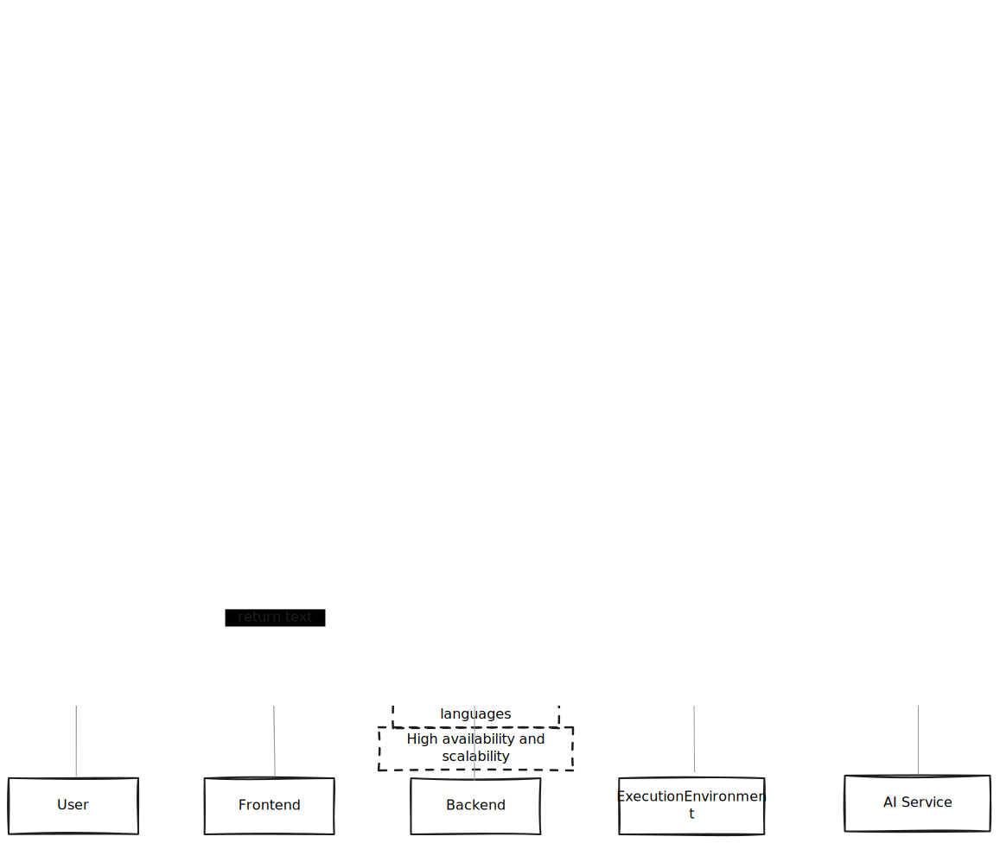
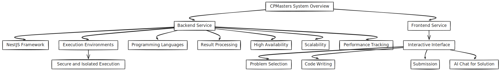

# CPMasters

CPMasters is a competitive programming platform designed to help users practice and improve their coding skills. It provides a comprehensive environment for users to solve coding problems, participate in contests, and receive feedback on their solutions. The platform supports multiple programming languages and offers real-time code execution and evaluation.

## Prerequisites

- pnpm (version X.X.X)

## Tech Stack

- **Backend**: NestJS
- **Frontend**: NextJS
- **Languages Supported**: C++, JavaScript, Python, Java
- **Database**: PostgreSQL, Redis

## Objectives

- Create a robust platform for competitive programming practice.
- Support multiple programming languages with real-time code execution.
- Provide detailed feedback and analysis of code submissions.
- Facilitate contests and challenges to engage users.
- Ensure a scalable and reliable system architecture.

## Key Features

- **Multi-Language Support**: Execute and evaluate code in various programming languages including C++ and JavaScript.
- **Real-Time Code Execution**: Immediate feedback on code submissions with real-time execution.
- **Detailed Feedback**: In-depth analysis of code performance, including time complexity and optimization suggestions.
- **Contests and Challenges**: Regularly scheduled contests and coding challenges to foster a competitive environment.
- **User Profiles and Leaderboards**: Track user progress and display rankings on leaderboards.
- **ASK AI**: (Description of this feature, if applicable)

## Workflow

## Sequential Diagram

## Installation

Visit our [Installation Guide](./apps/docs/installation.md) to learn how to install the project on your local machine.

## Contributing

Visit our [Contributing Guidelines](./apps/docs/contributing.md) to learn how to contribute to the project.

## Coding Standards

We follow industry standards, emphasizing test-driven development and clean, modular code. Please ensure your contributions adhere to these guidelines.

## License

This project is licensed under the `Custom License` to prevent commercial use. See the [LICENSE](LICENSE) file for details.

## Contact

If you want to contact us, please reach out at [hyattherate2005@gmail.com](mailto:hyattherate2005@gmail.com).

## Support

If you encounter any issues, please create an issue in our GitHub repository.

## Acknowledgments

- Thanks to all the contributors who helped in developing this project.
- Special thanks to the competitive programming community for their support and resources.

---

Enjoy practicing with CPMasters and enhance your coding skills!

---

For more detailed documentation, please refer to our Docs (coming soon).
